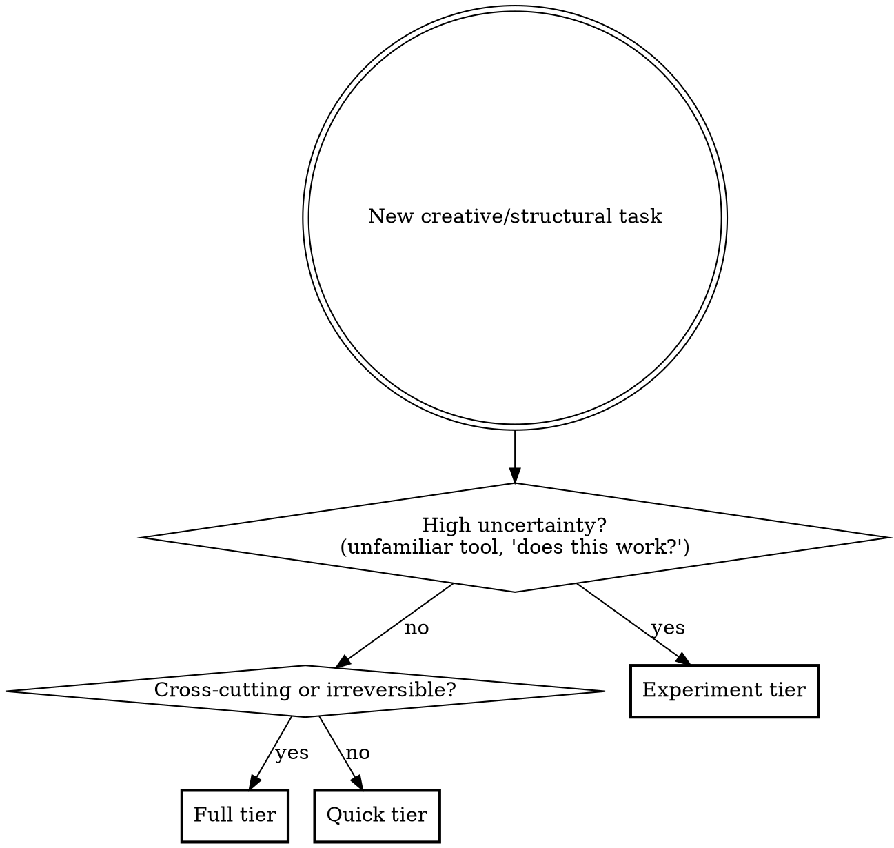

# Designing

Unified design skill with three tiers scaled to task complexity.

**Announce at start:** "I'm using the designing skill — selecting the [Quick/Experiment/Full] tier."

## Tier Selection

User can override tier choice at any time. Agent can upgrade mid-process if complexity reveals itself.

---

## Quick Tier

For clear, scoped tasks: single-file changes, well-understood requirements, reversible work.

**Steps:**

1. **Scan context** — glance at relevant files
2. **State intent** — 2-5 sentences: what you'll do, why, what it affects
3. **User confirms** — proceed to implementation; if questions arise, answer them, then re-confirm
4. **Transition** — invoke `writing-plans` or begin implementation directly for trivial tasks (user's call)

**Escape hatch:** If step 2 reveals the task touches more than expected, upgrade to Experiment or Full.

---

## Experiment Tier

For uncertainty-driven work: unfamiliar tools, "does this work?", core loop validation, reversible experiments.

**Core principle:** Prototype to learn, not to finalize.

**Steps:**

1. **Scan context** — check relevant files
2. **Write experiment frame** (5-10 lines):
   - `Hypothesis` — what you expect to learn
   - `Engineering fences` — what must not be changed, what invariants to preserve, files in scope
   - `Success signal` — how you'll know it worked
   - `Timebox` — how long before you stop
   - `Exit rule` — when to stop iterating
3. **User approves frame**
4. **Run smallest useful implementation** — prefer smoke checks over exhaustive tests
5. **Validate and record** — did it work? what did you learn?
6. **Decide next step:**
   - Stop (learned enough)
   - Iterate once more (refine hypothesis)
   - Promote: upgrade to Full tier if the direction needs durable design, or invoke `writing-plans` if boundaries are clear

**Escape hatch:** If the experiment reveals stable direction with clear boundaries, skip Full and go straight to `writing-plans`.

---

## Full Tier

For cross-cutting changes, irreversible decisions, multi-module work, or anything needing a durable design.

**Core principle:** Lock down the design in conversation before implementation.

**Steps:**

1. **Explore context** — check files, docs, recent commits
2. **Ask clarifying questions** — understand purpose, constraints, success criteria
   - Related questions can be grouped (max 3 per message)
   - Prefer multiple-choice when possible
   - If the project scope is too large, help decompose into sub-projects first
3. **Propose 2-3 approaches** — with trade-offs and your recommendation
4. **Present design in conversation** — get user feedback after each section
   - Cover: architecture, components, data flow, error handling, verification strategy
   - Identify touched boundaries and invariants
   - Include migration/rollback concerns if relevant
5. **User confirms design** — iterate in conversation until consensus; then transition to `writing-plans`

**Escape hatch:** If mid-process the task is simpler than expected, downgrade to Quick with user agreement.

---

## Shareable Design Brief (optional, all tiers)

If the user needs a written document to share outside the conversation (with teammates, for future reference, etc.), produce a concise design brief on request:

- **What:** 1-2 sentences on the goal
- **Why:** The key constraint or motivation
- **How:** Chosen approach in 3-5 bullets
- **Scope:** What's in, what's explicitly out
- **Risks:** Known trade-offs or open questions

Save to project-configured location or `docs/design/YYYY-MM-DD-<topic>.md`. Keep it short — this is a summary of decisions already made in conversation, not a spec to be reviewed.

---

## Design Principles (all tiers)

- **YAGNI ruthlessly** — remove unnecessary features from all designs
- **Design for isolation** — smaller units with clear boundaries, well-defined interfaces
- **Follow existing patterns** — in existing codebases, explore current structure before proposing changes
- **Targeted improvement only** — fix problems in code you're touching, don't propose unrelated refactoring

## Working in Existing Codebases

- Explore the current structure before proposing changes. Follow existing patterns.
- Where existing code has problems that affect the work, include targeted improvements as part of the design.
- Don't propose unrelated refactoring. Stay focused on what serves the current goal.

## Handoff Summary

| Tier | Terminal state |
|------|---------------|
| Quick | `writing-plans` or direct implementation (user's call) |
| Experiment | Stop, iterate, or promote to Full / `writing-plans` |
| Full | `writing-plans` |
